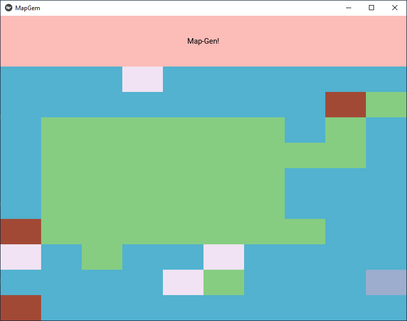
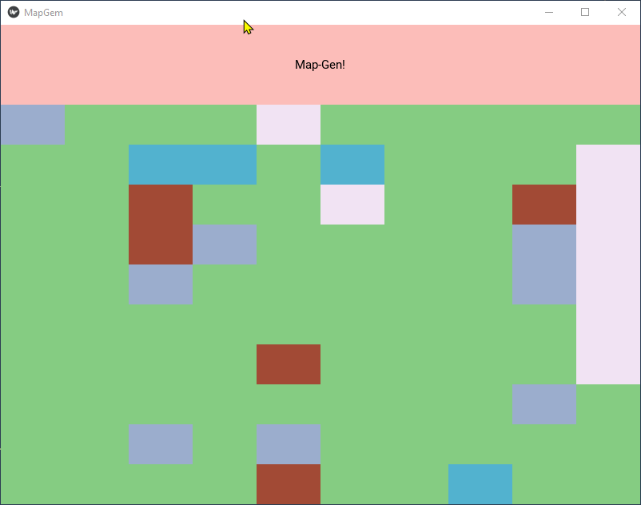

# MapGem

This program creates a grid and uses random probability to fill that grid with colors (tiles) that can represent anything that a user wants, such as objects for tabletop games.

## Features
* Tiles colors can represent trees, bodies of water, building, characters, and anything else from your imagination!
* Quickly create maps until you find the one that suits your interest.
